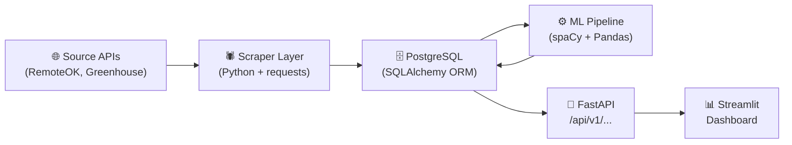

# AI Job Market Intelligence Platform — Architecture Analysis

## 1. High-Level Architecture Summary

The project is a **four-layer data pipeline** that flows strictly from left to right:



**No DOM scraping.** Both scrapers use public JSON APIs — RemoteOK at `https://remoteok.com/api` and Greenhouse at `https://boards-api.greenhouse.io/v1/boards/{token}/jobs`. This was an explicit design decision to avoid Playwright bot-detection failures that plagued the earlier version.

The dashboard never touches the database directly. It talks exclusively through the FastAPI layer via `dashboard/api_client.py`.

---

## 2. Folder Structure — Purpose of Every Directory

| Directory | Purpose |
|-----------|---------|
| `api/` | FastAPI application. Routes, Pydantic schemas, lifespan, CORS, error handlers. Pure HTTP layer — no raw queries. |
| `api/routes/` | One file per resource group (`jobs.py`, `stats.py`). Route handlers call CRUD functions, never write SQL. |
| `api/services/` | Declared but **empty** (`job_service.py`, `trend_service.py` exist but have no implementation). Not yet used by routes. |
| `database/` | Everything PostgreSQL. Engine, session factory, ORM models, all CRUD functions. |
| `dashboard/` | Streamlit single-page app (`app.py`), chart factory (`charts.py`), API client (`api_client.py`), formatting utils (`utils.py`). |
| `dashboard/components/` | Declared but **empty directory**. No components have been extracted yet. |
| `ml/` | Analytics pipeline. Skill extractor, trend analyzer, salary analyzer, pipeline scheduler, shared constants and utils. |
| `scraper/` | Two scrapers (RemoteOK, Greenhouse). Several stub files (`bs4_parser.py`, `cleaner.py`, `constants.py`, `parser.py`, `scheduler.py`, `utils.py`) exist but are either empty or minimal. |
| `notebooks/` | Jupyter notebooks directory (present but contents not explored — likely EDA). |
| `tests/` | Tests directory (present but contents not explored). |
| `docker/` | Docker files. |
| `.env` | Environment variables (DB credentials, API config). |
| `config.py` | Pydantic-settings class — single source of truth for all config. Reads `.env`. |

---

## 3. Purpose of Every Major Python Module

### `config.py`
Pydantic `BaseSettings` class. Validates and type-coerces all environment variables at startup. Computes `DATABASE_URL` from individual DB components. Exports a `settings` singleton used across the entire project.

### `database/connection.py`
Defines `Base` (declarative ORM base), creates the SQLAlchemy engine with connection pooling (`QueuePool`), creates `SessionLocal` factory, provides `get_db()` (FastAPI dependency) and `get_db_session()` (context manager for scraper/ML), exposes `check_database_connection()` and `create_tables()`.

### `database/models.py`
Defines all three ORM tables:
- **`Job`** — core entity (1 row = 1 scraped job). 30+ columns. GIN index on `skills` ARRAY, GIN index on `raw_metadata` JSONB, composite B-tree indexes.
- **`SkillTrend`** — pre-aggregated skill demand metrics per time period. Written by ML pipeline. Read by dashboard.
- **`ScrapeRun`** — audit log for every scraper execution. Operational monitoring.

Also defines three `str, enum.Enum` types: `ExperienceLevel`, `JobType`, `TrendDirection`.

### `database/crud.py`
Repository layer (~1,300 lines). All database reads and writes pass through here. Key functions include:
- `insert_job()` / `bulk_insert_jobs()` — deduplication via `ON CONFLICT DO NOTHING`
- `get_jobs()` — filterable, sortable, paginated job query
- `get_top_skills()` — PostgreSQL `unnest()` aggregation on skills ARRAY
- `get_recent_scrape_runs()` — audit log reads
- `upsert_skill_trend()` — ML pipeline writes pre-computed trends
- `update_job_skills()` / `mark_skills_extracted()` — ML pipeline status flags
- `create_scrape_run()` / `complete_scrape_run()` / `fail_scrape_run()` — audit trail

### `api/main.py`
FastAPI app assembly. Lifespan (startup DB check + table creation), CORS middleware (allows Streamlit at `:8501`), global 500 error handler, router registration. Read-only API (only GET methods allowed via CORS).

### `api/routes/jobs.py`
Three endpoints:
- `GET /api/v1/jobs` — paginated, filterable job list (10 query parameters)
- `GET /api/v1/jobs/with-salary` — jobs with disclosed compensation only
- `GET /api/v1/jobs/{job_id}` — single job full detail

### `api/routes/stats.py`
Three endpoints:
- `GET /api/v1/stats/top-skills` — skill frequency ranking
- `GET /api/v1/stats/scrape-runs` — recent scraper audit records
- `GET /api/v1/stats/health` — API + DB health check (total job count, last scrape)

### `api/schemas.py`
Six Pydantic response models: `JobSummary`, `JobResponse`, `PaginatedJobsResponse`, `SkillCount`, `TopSkillsResponse`, `ScrapeRunResponse`, `ScrapeRunsResponse`, `HealthResponse`, `ErrorResponse`. All inherit `_Base(ConfigDict(from_attributes=True))` to read from SQLAlchemy ORM objects.

### `dashboard/app.py`
1,439-line Streamlit monolith. Contains:
- ~550 lines of inline CSS (green/white SaaS theme)
- 5 `@st.cache_data` loader functions (TTL: 300s for health/skills/runs, 60s for jobs)
- Sidebar renderer (`_render_sidebar()`) returning `ctx = {page, country, posted_after}`
- Four page functions: `_page_overview()`, `_page_skills()`, `_page_salary()`, `_page_jobs()`
- `_render_job_card()` and `_clean_desc()` helpers
- `_empty_card()` shared empty-state renderer
- `main()` called unconditionally once at module level

### `dashboard/api_client.py`
All HTTP communication in one module. Builds a `requests.Session` with retry/backoff. Every function returns typed Python dicts/lists. Returns safe empty defaults on error — dashboard never sees raw exceptions. Five public functions: `get_health()`, `get_top_skills()`, `get_scrape_runs()`, `get_jobs()`, `get_jobs_with_salary()`, `get_job_detail()`, `check_api_reachable()`.

### `dashboard/charts.py`
Plotly chart factory. Returns `go.Figure` objects only — zero Streamlit calls. Consistent green/white theme via `_apply_theme()`. Charts: `bar_top_skills()`, `bar_skills_comparison()`, `pie_remote_vs_onsite()`, `pie_jobs_by_country()`, `bar_salary_by_skill()`, `bar_salary_by_country()`, `bar_salary_by_experience()`, `gauge_remote_salary_premium()`, `bar_scrape_history()`.

### `dashboard/utils.py`
Formatting functions (`fmt_number`, `fmt_salary`, `fmt_salary_range`, `fmt_datetime`, `fmt_relative_time`, `fmt_skills_list`, `fmt_status_badge`, `fmt_location`), DataFrame converters (`jobs_to_dataframe`, `skills_to_dataframe`, `scrape_runs_to_dataframe`), salary aggregation (`build_salary_by_skill` — computes median/p25/p75 per skill client-side), pagination renderer (`render_pagination`), UI helpers (`metric_card`, `show_api_error`, `show_empty_state`, `skill_tags`, `section_header`, `card_html`).

### `scraper/playwright_scraper.py`
Despite the name, uses `requests` against the RemoteOK JSON API. Handles retries, rate limiting, salary parsing, experience/job-type inference, tag noise filtering, and bulk insert with full scrape run audit logging.

### `scraper/greenhouse_scraper.py`
Hits the public Greenhouse Board API for a configurable list of company board tokens. HTML description preserved for later ML skill extraction. Infers city/country from location string. No salary data (Greenhouse doesn't expose it).

### `ml/scheduler.py`
Pipeline orchestrator. Accepts CLI flags (`--skip-scraper`, `--only-skills`, `--only-trends`, `--only-salary`, etc.). Runs stages in order: scraper → skill extraction → trend analysis → salary analysis. Failure-isolated: each stage's exception is caught and logged, subsequent stages still run. Reports a final summary table.

### `ml/skill_extractor.py`
NLP pipeline using `spaCy en_core_web_sm`. Processes jobs where `is_skills_extracted=False`. Merges scraper-provided tags with NLP-extracted skills. Uses `KNOWN_SKILLS` dictionary lookup + `SKILL_ALIASES` normalization from `ml/constants.py`. Writes merged skills back via `crud.update_job_skills()` and marks `is_skills_extracted=True`.

### `ml/trend_analyzer.py`
Reads jobs per month using raw SQL (`unnest(skills)`). Computes `job_count`, `job_count_change`, `job_count_change_pct`, `trend_direction` (RISING/STABLE/DECLINING/NEW), co-occurring skills (JSONB map), salary per skill. Upserts into `skill_trends` via `crud.upsert_skill_trend()`. Runs globally and per top-5 country.

### `ml/salary_analyzer.py`
Loads salary-disclosed jobs. Normalizes all currencies to USD using static conversion rates. Computes median, p25, p75 salary by skill, country, experience level, and remote vs on-site. Returns Python dicts — results feed into `skill_trends` rows.

### `ml/constants.py`
`SKILL_ALIASES` normalization map (~100 aliases), `KNOWN_SKILLS` whitelist (likely hundreds of entries), `NOISE_WORDS`, thresholds (`TREND_RISING_THRESHOLD`, `MIN_JOBS_FOR_TREND`, etc.), `USD_CONVERSION_RATES`, `SUPPORTED_CURRENCIES`.

### `ml/utils.py`
Shared ML utilities: `batched()`, `clean_text()`, `tokenize()`, `truncate()`, `timed()` decorator, `utcnow()`, `month_boundaries()`, `months_back()`, `pct_change()`, `safe_float()`, `safe_int()`, `log_pipeline_summary()`.

---

## 4. Data Flow Through the Application

### Ingestion Path (Scraper → Database)
```
1. Scraper CLI invoked:
   python -m scraper.playwright_scraper
   python -m scraper.greenhouse_scraper
   
2. Scraper calls crud.create_scrape_run() → inserts ScrapeRun with status="running"

3. Scraper fetches JSON from API endpoint
   RemoteOK: https://remoteok.com/api
   Greenhouse: https://boards-api.greenhouse.io/v1/boards/{token}/jobs?content=true

4. Each job dict is cleaned/normalized inline:
   - Salary strings parsed → salary_min, salary_max (integers, smallest currency unit)
   - Experience level inferred from title keywords
   - Job type inferred from tags/title
   - Skills populated from API tags (noise-filtered)
   - is_remote, is_hybrid set from location/tag analysis

5. crud.bulk_insert_jobs() → PostgreSQL INSERT ... ON CONFLICT DO NOTHING
   (dedup enforced via UNIQUE constraint on source_url)

6. crud.complete_scrape_run() → updates ScrapeRun with stats and status="completed"
```

### ML Processing Path (Database → Database)
```
7. ML scheduler invoked (manually or as a cron):
   python -m ml.scheduler

8. SKILL EXTRACTION (ml/skill_extractor.py):
   - Queries: SELECT * FROM jobs WHERE is_skills_extracted = false
   - For each job: merge existing tags + spaCy NLP on title+description
   - Apply SKILL_ALIASES normalization
   - crud.update_job_skills(db, job_id, merged_skills)
   - crud.mark_skills_extracted(db, job_id)

9. TREND ANALYSIS (ml/trend_analyzer.py):
   - For each month in window (default: 3 months back):
     - SQL: SELECT skills, salary_min, ... FROM jobs WHERE posted_at IN [month]
     - Count skill frequencies, compare to prev month
     - Classify RISING/STABLE/DECLINING/NEW
     - crud.upsert_skill_trend() → writes to skill_trends table
   - Runs globally (country=NULL) AND per top-5 country

10. SALARY ANALYSIS (ml/salary_analyzer.py):
    - Loads jobs with salary_min OR salary_max IS NOT NULL
    - Normalizes currencies to USD (static rates)
    - Computes medians/percentiles by skill, country, experience level
    - Results embedded into skill_trends rows by trend_analyzer
```

### Read Path (Database → API → Dashboard)
```
11. FastAPI receives request from Streamlit dashboard

12. Route handler (api/routes/jobs.py or stats.py):
    - Parses and validates query parameters
    - Calls crud function with typed arguments
    - Validates sort column whitelist
    - Wraps ORM result in Pydantic schema
    - Returns JSON

13. dashboard/api_client.py:
    - requests.Session with retry adapter (3 retries, backoff 0.5/1/2s)
    - Returns parsed JSON dict or safe empty default on failure

14. dashboard/app.py @st.cache_data loaders:
    - TTL=300s for health/skills/runs (slow-changing)
    - TTL=60s for job listings (user-facing, changes more frequently)
    - Cache keyed by all function arguments (explicit named params, not **kwargs)

15. Page function renders:
    - Sidebar ctx (country, posted_after) used as API filter params
    - charts.py returns go.Figure → st.plotly_chart()
    - utils.py formats data → st.dataframe() / st.metric()
```

---

## 5. Architectural Weaknesses

### A. Single-Source Scraping
Only two sources (RemoteOK and Greenhouse). The `source_platform` column is designed for multi-source, but the infrastructure for LinkedIn, Indeed, or Naukri scrapers doesn't exist. The `scraper/` directory has stub files (`bs4_parser.py`, `cleaner.py`, `parser.py`, `scheduler.py`) that appear empty or incomplete, suggesting planned scrapers were never built.

### B. Dashboard is a 1,439-line Monolith
`dashboard/app.py` contains CSS, caching, sidebar logic, four full page implementations, and several inline chart definitions that bypass `charts.py`. The `dashboard/components/` directory is empty — nothing has been extracted there. Long-term maintainability risk.

### C. Static Currency Conversion Rates
`ml/constants.py` stores `USD_CONVERSION_RATES` as a hardcoded dict. In production this needs a live exchange rate API. Salary comparisons across currencies (INR vs USD) will drift silently as FX rates change.

### D. Salary Data Bottleneck
Only ~15-25% of RemoteOK jobs disclose salary. Greenhouse boards rarely include compensation. The Salary Intelligence page (`_page_salary`) is limited by this. The ML salary analysis is Python-side (not PostgreSQL aggregations), which will not scale past tens of thousands of salary-disclosed jobs.

### E. No Job Deduplication Across Platforms
The `UNIQUE` constraint is on `source_url` only. The same job posted on both RemoteOK and a Greenhouse board (common for tech companies) will be stored as two separate records. There is no cross-platform canonical dedup.

### F. Trend Data Requires Manual ML Pipeline Run
The `SkillTrend` table is only populated by `python -m ml.scheduler`. There is no automated scheduling (cron, Celery, APScheduler). If the operator forgets to run it, trend data goes stale. The `scraper/scheduler.py` stub exists but appears empty.

### G. API is Read-Only by Design, But SkillTrend Has No API Endpoint
The `SkillTrend` table exists and is populated by the ML pipeline, but FastAPI exposes zero endpoints to query it. The dashboard reads skill trends from `/stats/top-skills` which counts skills from the raw `jobs.skills` ARRAY — it does **not** query `skill_trends` at all. The pre-aggregated trend table is currently unused by the dashboard.

### H. `api/services/` is Declared but Empty
`api/services/job_service.py` and `trend_service.py` exist but are empty/stub files. The routes call `crud.py` directly, skipping the service layer. This is fine for now, but the empty files imply a pattern the codebase hasn't committed to.

### I. Skills Page "Distribution" Tab is Misleading
The "🥧 Distribution" tab in the Skills page uses `pie_remote_vs_onsite()` but passes "top half vs bottom half by skill frequency" — this is semantically wrong and confusing for users.

### J. No Error Boundary Between Inline Charts and `charts.py`
The Overview page has inline `px.bar()` calls for "Top Hiring Companies" and "Top Job Titles" that duplicate theme configuration from `charts.py`. They don't use `_apply_theme()`. If the theme changes, these charts won't update automatically.

---

## 6. Technical Debt

| Item | Location | Risk |
|------|----------|------|
| Empty stub files | `scraper/bs4_parser.py`, `scraper/cleaner.py`, `scraper/parser.py`, `scraper/scheduler.py`, `scraper/utils.py` | Confusion about scope; if these are needed, they're silent gaps |
| Empty component dir | `dashboard/components/` | Misleading — nothing has been componentized |
| Empty service layer | `api/services/job_service.py`, `api/services/trend_service.py` | Architectural pattern declared but abandoned |
| `SkillTrend` table unused by API | `api/routes/` | 700+ lines of model + ML pipeline generate data no endpoint serves |
| README.md is empty | `README.md` | Critical gap for a portfolio project — no setup instructions |
| `dashboard/app.py` inline CSS | Lines 57–550 | ~490 lines of CSS embedded in Python string; hard to maintain |
| Salary dashboard caps at 100 jobs | `_load_jobs_with_salary(page_size=100)` | At scale, misleading statistics if >100 salary-disclosing jobs exist |
| `import pandas as pd` inside page functions | Lines 1079, 1117 | Already imported at top of file — redundant local imports |
| `skill_tags()` uses dark theme colors | `utils.py:252-257` | Badge colors (`#1a3a5c`, `#60a5fa`) are dark-theme colors; rest of app is light-theme |
| `error_log.txt` is 3.4 MB | Root dir | Indicates prior runtime errors; should not be committed |
| `database/TEST.PY` in production directory | `database/TEST.PY` | Uppercase filename, test code inside the database package |

---

## 7. What Remains Before Version 1 is Complete

### Critical (must-have before calling it done)
1. **README.md** — The project has zero documentation. A portfolio project with an empty README is not presentable. Needs: project description, architecture diagram, setup steps (`.env`, PostgreSQL, `pip install`, scraper command, ML pipeline command, how to start API + dashboard).
2. **Fix the Skills Distribution tab** — The "Distribution" pie chart repurposes `pie_remote_vs_onsite()` with semantically incorrect labels. Should be replaced with a proper top-N vs bottom-N or a treemap of skill categories.
3. **Salary page 100-job cap** — `_load_jobs_with_salary(page_size=100)` silently limits salary analysis. Either paginate through all results or make the cap visible to the user.

### High Priority (polish for portfolio quality)
4. **`skill_tags()` badge colors** — Dark-theme color tokens (`#1a3a5c`, `#60a5fa`) clash with the light SaaS theme everywhere else. Fix to match the green palette.
5. **Section headers use dark color** — `utils.section_header()` renders `color:#f1f5f9` (nearly white) which is invisible on the light background. Should be `#0d1f17` (dark green).
6. **SkillTrend API endpoint** — The `skill_trends` table is populated but has no API route exposing it. A `/api/v1/stats/skill-trends` endpoint would let the dashboard display month-over-month trend lines (rising/declining arrows) — a key differentiator for a market intelligence tool.
7. **Automated pipeline scheduling** — Add a cron schedule or APScheduler call in `ml/scheduler.py` so trend data refreshes without manual intervention.

### Medium Priority (completeness)
8. **Delete dead code** — `api/services/`, empty `scraper/` stubs, `dashboard/components/` directory, `database/TEST.PY`.
9. **Scraper robustness** — Add rate limiting / backoff in `greenhouse_scraper.py` for boards with many companies. Currently, a single failed board blocks the batch for that company.
10. **Tests** — `tests/` directory exists but was not explored. At minimum, integration tests for the API endpoints and unit tests for `crud.get_jobs()` filter logic would be expected for a portfolio-quality codebase.
11. **Docker Compose** — `docker-compose.yml` exists; verify it correctly starts API + dashboard + PostgreSQL for one-command local setup.

### Nice to Have (bonus)
12. **Trend line chart** — Currently no time-series visualization exists. A line chart of Python/React/Kubernetes demand over the last 6 months using `skill_trends` data would be the most powerful visual in the dashboard.
13. **Second scraper source** — Adding LinkedIn Easy Apply or Indeed via their APIs would diversify the data and make the market intelligence more representative.
14. **Geography chart** — `charts.py` has `pie_jobs_by_country()` but it is never called from `app.py`. The Overview page could use it.
